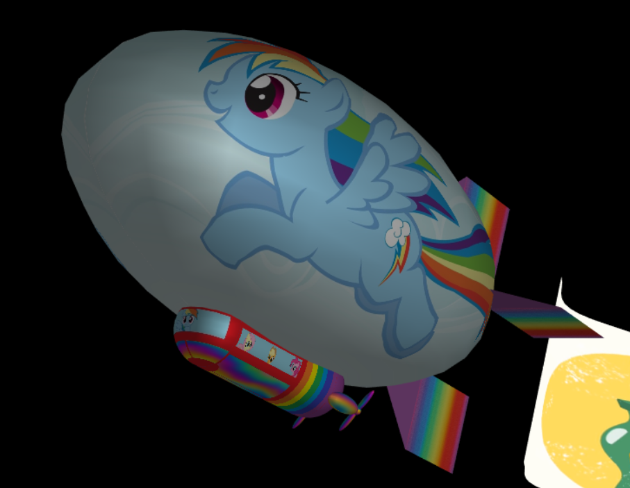
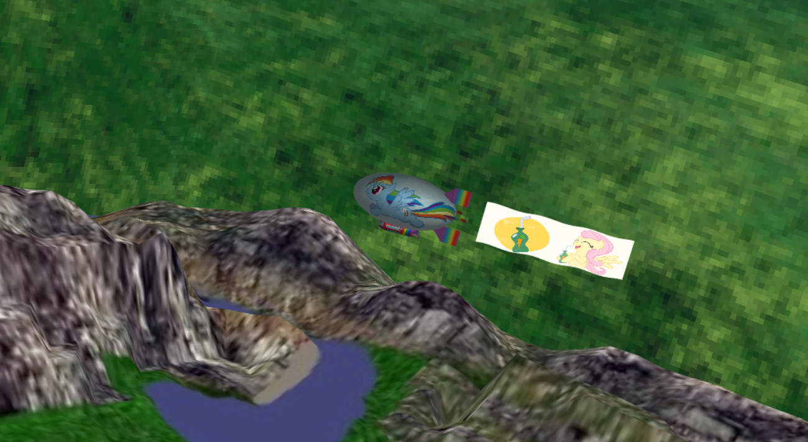
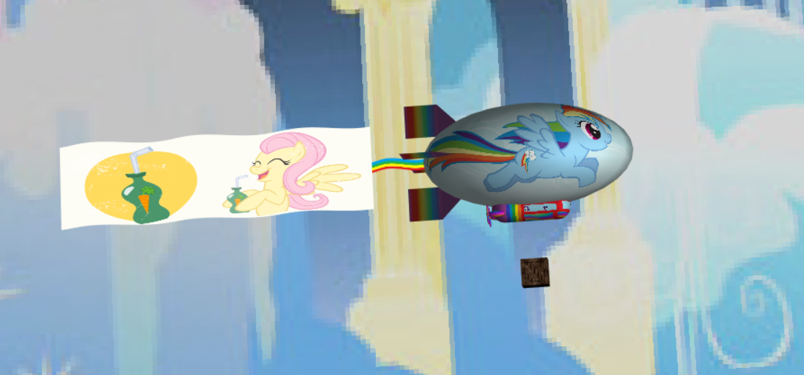
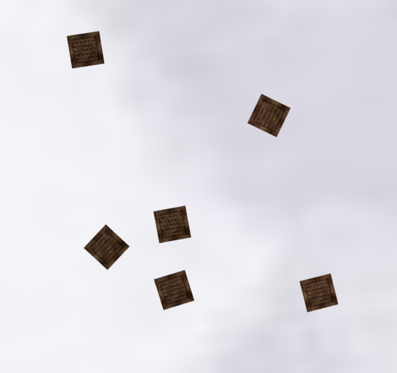
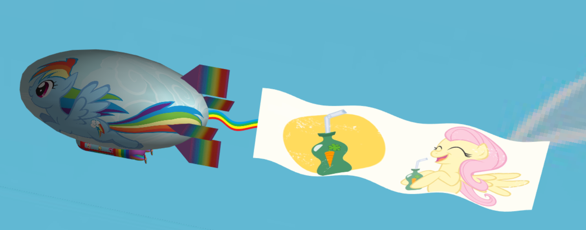
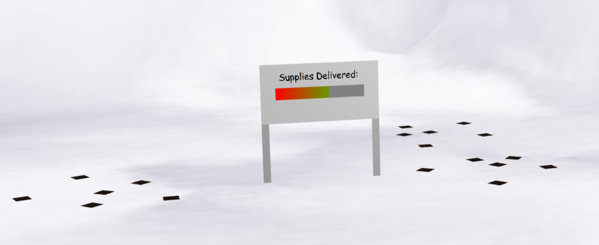

# Magical Zeppelin

**Short Description**: Final project built with WebGL using [WebCGF](https://paginas.fe.up.pt/~ruirodrig/pub/sw/webcgf/docs/) library

**Institution**: [FEUP](https://sigarra.up.pt/feup/en/web_page.Inicial)

**Course**: [MIEIC](https://sigarra.up.pt/feup/en/cur_geral.cur_view?pv_curso_id=742&pv_ano_lectivo=2019)

**Curricular Unit**: [CGRA](https://sigarra.up.pt/feup/en/ucurr_geral.ficha_uc_view?pv_ocorrencia_id=399891) (Computer Graphics)

### Group Members
- Diogo Samuel Fernandes, up201806250@fe.up.pt
- Hugo Guimarães, up201806490@fe.up.pt

### Description

The aim of this project was built a WebGL scene using transformations, illumination, materials, textures and shaders that we learned in practical classes. The source code that we did in practical classes can be found in [this repository]().

Some skybox textures used in this project can be found on [Open Game Art](https://opengameart.org/art-search?keys=skybox).

### Setup

To run this project you need to start a local server on its root. If you have trouble configuring your local server you can also see this project on [Github Pages]().

### Tools Used

- Javascript
- WebGL
- WebCFG

### Textures

The terrain and skybox's textures, as well as their visibility on the scene, can be changed in the interface, specifically in the *Scenario Config* folder. Vehicle textures and visibility can be changed in the Vehicle Config folder.

##### CubeMap

We have many SkyBox textures that we found online. Two of them are inspired by *My Little Pony*.

##### Zeppelin Texture

We made two different textures for our Zeppelin. The former is inspired by *Rainbow Dash*, a pegasus from *My Little Pony*, and the latter is inspired by the game *Portal*.

##### Supply texture

There are 2 different textures for the Supply. The selected texture can either be the default wood crate, or the *Companion Cube* from *Portal*

### Other Remarks

In addition, it is also possible to view both the cylinder and the sphere individually, as well as the normals of all currently displayed objects on the scene.

Also, if the current SkyBox texture is either Palace or Rainbow Dash, you can listen to *My Little Pony*'s theme song in Portuguese by selecting the textBox *Music* in *Scenario Config*.

Our Supplies also have horizontal movement, following the rotation and direction of our zeppelin.

### Instructions/Keys

- W - Increase Speed
- D - Decrese Speed
- A - Turn Left
- D - Turn Right
- L - Drop a Box from the Zeppelin (Up to 5 boxes)
- P - Toggle Auto-Pilot
- R - Restart Scene

### Screenshots

##### Zeppelin Texture - Rainbow Dash and friends

##### Terrain

##### Supply Deliver

##### Flag

##### Billboard

